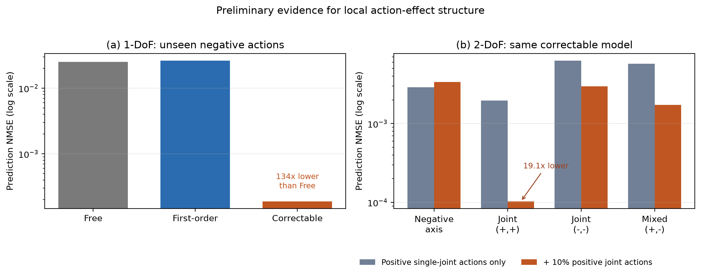

# Learning Action-Effect Structure from Limited Physical Interaction

This repository accompanies a research positioning paper on a simple question:

> Under limited physical interaction, which local action-effect relations can be identified, reused, and corrected? Can a learning system exploit these relations to reduce the number of real transitions required to reach a specified level of prediction and control performance?

The initial hypothesis is that short-horizon action effects contain a shared local first-order component together with learnable higher-order deviations. The repository contains the proposal and two deliberately small experiments that test this mechanism before moving to learned visual representations and real robots.

- [Research proposal](PROPOSAL.md)

## Preliminary evidence



- **One degree of freedom:** after training only on positive actions, a first- plus second-order model reduced normalized prediction error on unseen negative actions by approximately **134×** relative to a similarly sized free model.
- **Two degrees of freedom:** axis-only actions cannot identify the quadratic cross term $u_1u_2$. Adding approximately 10% joint actions, without increasing the total interaction budget, reduced error on positive joint actions by approximately **19.1×** for the same structured model.

These experiments are mechanism checks in noiseless coordinate observations. They do not establish data-efficiency gains on real robots.

## Repository structure

```text
.
├── PROPOSAL.md
├── assets/
│   └── preliminary_results_summary.png
├── experiments/
│   ├── one_dof/
│   │   ├── experiment.py
│   │   ├── README.md
│   │   ├── RESULTS.md
│   │   └── results/
│   └── two_dof/
│       ├── experiment.py
│       ├── README.md
│       ├── RESULTS.md
│       └── results/
├── requirements.txt
└── run_experiments.py
```

## Reproduction

Create a Python environment and install the shared dependencies:

```bash
python -m venv .venv
python -m pip install -r requirements.txt
```

Run reduced smoke tests for both experiments:

```bash
python run_experiments.py --quick
```

Run the complete configurations used for the checked-in results:

```bash
python run_experiments.py
```

Each experiment can also be run independently from its own directory. The checked-in `results/` folders contain per-seed metrics, aggregate tables, JSON records, diagnostics, and learning curves.

